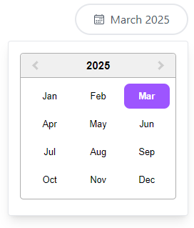

# @trackpilots/month-picker


A **customizable month picker** component built with **React** and **Tailwind CSS**.

## ✨ Screenshots  


---

## 🚀 Installation  
You can install the package using **npm** or **yarn**:  

### **Using npm**  
```sh
npm install @trackpilots/month-picker
# or
yarn add @trackpilots/month-picker
```

Make sure Tailwind CSS is installed in your project.

##  📌 Usage
Use in Your Component
```sh
import React, { useState } from "react";
import MonthPicker from "@trackpilots/month-picker";

const App = () => {
  const [selectedMonth, setSelectedMonth] = useState(null);

  const handleSelect = (month) => {
    setSelectedMonth(month);
    console.log("Selected Month:", month);
  };


  return (
    <div className="p-4">
      <h2 className="text-lg font-bold">Date Picker</h2>
      <MonthPicker
        selectedDate={new Date("2024-06-01")} 
        onSelect={handleSelect}
        selectedColor="#FF5733"
      />
      <p>Selected Month: {selectedMonth ? selectedMonth.month : "None"}</p>
    </div>
  );
};

export default App;
```

## 📌 DateFilter Component
A React Select component that allows users to choose a month

## ⚙️ Props  

| Prop Name      | Type              | Default          | Description                          |
|---------------|------------------|----------------|----------------------------------|
| `selectedDate` | `Date` or `null`  | `null`         | The date of the month picker. |
| `onSelect`    | `function`        | `() => {}`     | Triggered when a month is selected. |
| `selectedColor` | `string`        | `"#9D55FF"`    | Highlight color for the selected month. |
| `icon`        | `React.ElementType` | `IoCalendarOutline` | Custom calendar icon component. |
---

## **✨ Example**  
```sh
<MonthPicker 
  selectedDate={new Date("2024-06-01")} 
  onSelect={(month) => console.log("User selected:", month)} 
  selectedColor="#007BFF"
/>
```

## 📦 Dependencies  

- [React](https://react.dev/)  
- [Tailwind CSS](https://tailwindcss.com/)  
- [react-icons](https://react-icons.github.io/react-icons/) (for `IoCalendarOutline` icon)  


## 📌 Maintainers
These packages are maintained by [**Quick App Studio**](https://quickappstudio.com/our-team) Developers.

##  📄 License
This project is licensed under the MIT License.